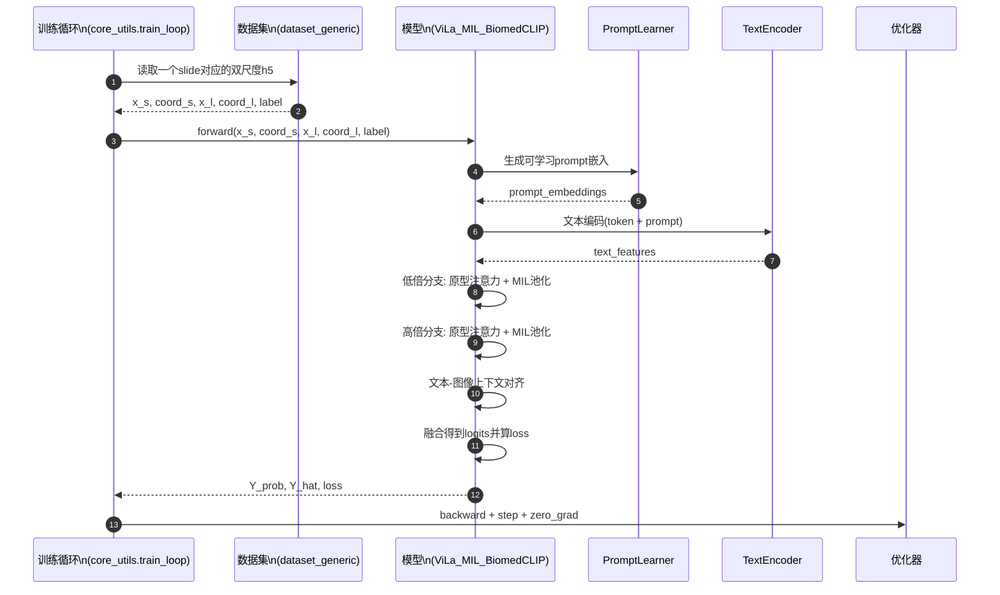
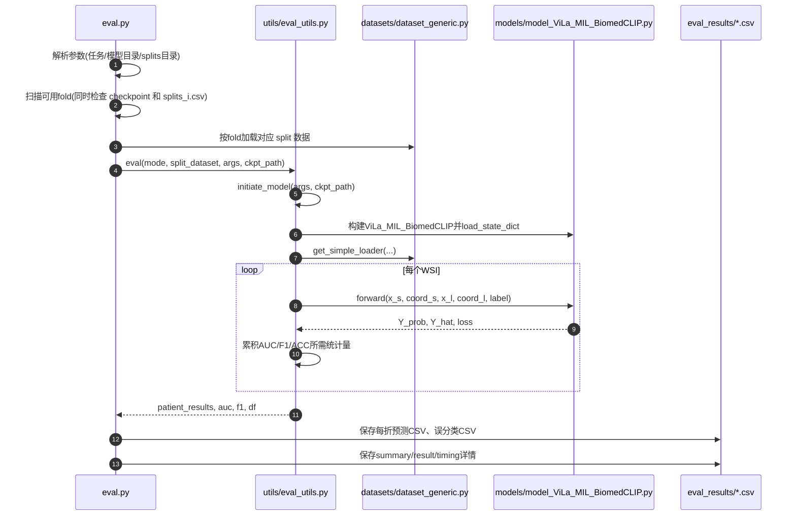

# ViLa-MIL(BiomedCLIP版) 时序图与中文解读

这份文档的目标：
- 用一张更容易读懂的时序图，解释你当前项目代码在训练时做了什么。
- 把每一步对应到代码文件，方便你回到代码里定位。

---

## 1. 先用一句话理解整个流程

你现在的训练流程是：

1. 从每个 slide 的 h5 里读出双尺度 patch 特征（5x 和 20x）。
2. 模型用可学习提示词 + BiomedCLIP 文本编码器得到文本特征。
3. 模型分别在低倍和高倍分支做原型注意力聚合（MIL）。
4. 图像特征与文本特征再做一次上下文对齐。
5. 得到分类 logits，计算损失，反向传播更新参数。

注意：训练阶段主要使用的是"预提取好的图像特征"，不是每个 step 都把原始图像喂进视觉编码器。

---

## 2. 简化时序图（训练一个 batch）



---

## 3. 每一步在代码里是谁做的

### 第1步：读取双尺度特征
- 文件：`datasets/dataset_generic.py`
- 类：`Generic_MIL_Dataset`
- 关键行为：按 `slide_id` 打开两个 h5（低倍和高倍），返回
  - `features_s, coords_s`
  - `features_l, coords_l`
  - `label`

### 第2步：训练循环拿到一个 batch
- 文件：`utils/core_utils.py`
- 函数：`train_loop(...)`
- 关键行为：
  - 从 DataLoader 取出一个 batch
  - 调用 `model(...)`
  - 得到 `Y_prob, Y_hat, loss`

### 第3步：Prompt 与文本编码
- 文件：`models/model_ViLa_MIL_BiomedCLIP.py`
- 模块：
  - `BiomedCLIPPromptLearner`
  - `BiomedCLIPTextEncoder`
- 关键行为：
  - 先构造可学习 prompt
  - 再通过 BiomedCLIP 文本塔生成文本向量

### 第4步：双尺度 MIL 聚合
- 文件：`models/model_ViLa_MIL_BiomedCLIP.py`
- 类：`ViLa_MIL_BiomedCLIP`
- `forward(...)` 内部关键行为：
  - 低倍分支：`cross_attention_1` -> gated attention pooling
  - 高倍分支：`cross_attention_1` -> gated attention pooling

### 第5步：文本-图像上下文对齐与分类
- 文件：`models/model_ViLa_MIL_BiomedCLIP.py`
- `forward(...)` 内部关键行为：
  - `cross_attention_2` 让文本特征感知图像上下文
  - 计算 `logits_low` 和 `logits_high`
  - 相加得到最终 `logits`
  - `CrossEntropyLoss` 得到损失

### 第6步：反向传播与参数更新
- 文件：`utils/core_utils.py`
- 函数：`train_loop(...)`
- 关键行为：
  - `loss.backward()`
  - `optimizer.step()`
  - `optimizer.zero_grad()`

---

## 4. 你最容易混淆的一点（重点）

很多人会问：
> 既然叫 BiomedCLIP 版，是不是训练时在端到端训练图像编码器？

在你当前这套代码里，通常不是。

- 图像编码器更多用于前处理阶段（离线提取 patch 特征并保存 h5）。
- 训练阶段读取的是 h5 里的特征向量，再做 MIL 与文本对齐。
- 所以训练主干里，重点是聚合与分类头，而不是重新编码原始图像像素。

---

## 5. 怎么读这套代码最快

建议按这个顺序：

1. `main.py`（入口与参数）
2. `utils/core_utils.py`（训练主循环）
3. `datasets/dataset_generic.py`（输入长什么样）
4. `models/model_ViLa_MIL_BiomedCLIP.py`（核心前向）
5. `utils/eval_utils.py` + `eval.py`（评估链路）

---

## 6. 一句话总结

你当前项目的 BiomedCLIP 版 ViLa-MIL，本质是：

- 用 BiomedCLIP 提供文本语义能力（并配合可学习 prompt），
- 用双尺度 MIL 结构对 WSI patch 特征做聚合，
- 以分类任务目标（AUC/ACC/F1）进行训练。

---

## 7. 评估/推理链路时序图（你项目代码版）



### 评估阶段核心要点

1. `eval.py` 会先自动筛选可用折（必须同时存在 `s_i_checkpoint.pt` 和 `splits_i.csv`）。
2. 每折都会重建模型并加载权重，再逐WSI前向预测。
3. 最后会导出每折详情与总体统计，默认在 `eval_results/EVAL_<save_exp_code>/` 下。

---

## 8. 训练流程命令清单（按步骤，可直接改模板）

下面给你两层：
- A层：完整从0开始（坐标/patch/特征/切分/训练）
- B层：如果你已经有特征和切分，只跑训练

### 8.1 A层：从0开始完整流程

#### Step A1: 生成WSI patch坐标与掩膜

```bash
python create_patches_fp.py \
  --source <WSI_SVS_DIR> \
  --slide_name_file <SLIDE_NAME_CSV> \
  --uuid_name_file <UUID_NAME_CSV> \
  --preset tcga.csv \
  --save_dir <PATCH_COORD_SAVE_DIR> \
  --patch_size 256 \
  --step_size 256 \
  --seg \
  --patch
```

说明：
- 该步骤会在 `<PATCH_COORD_SAVE_DIR>` 下生成 `patches_256/`、`masks/` 等目录。

#### Step A2: 依据坐标真正裁patch图片（双尺度）

```bash
python patch_generation_5x.py
python patch_generation_20x.py
```

说明：
- 这两个脚本通常需要你先在文件内配置路径（项目当前写法如此）。

#### Step A3: 提取BiomedCLIP特征（5x）

```bash
python feature_extraction/patch_extraction_biomedclip.py \
  --patches_path <PATCH_IMAGE_DIR_5X> \
  --library_path <FEATURE_DIR_5X> \
  --batch_size 32 \
  --dataset <DATASET_NAME>
```

#### Step A4: 提取BiomedCLIP特征（20x）

```bash
python feature_extraction/patch_extraction_biomedclip.py \
  --patches_path <PATCH_IMAGE_DIR_20X> \
  --library_path <FEATURE_DIR_20X> \
  --batch_size 32 \
  --dataset <DATASET_NAME>
```

#### Step A5: 生成k折划分

```bash
python create_splits_seq.py \
  --label_frac 1 \
  --k 5 \
  --task <TASK_NAME> \
  --val_frac <VAL_FRAC> \
  --test_frac <TEST_FRAC> \
  --dataset <DATASET_NAME>
```

#### Step A6: 启动训练（BiomedCLIP版ViLa-MIL）

```bash
export CUDA_VISIBLE_DEVICES=0

python main.py \
  --seed 1 \
  --drop_out \
  --early_stopping \
  --lr 1e-4 \
  --k 5 \
  --label_frac 1 \
  --bag_loss ce \
  --task <TASK_NAME> \
  --results_dir <TRAIN_RESULTS_ROOT> \
  --exp_code <EXP_CODE> \
  --model_type ViLa_MIL_BiomedCLIP \
  --mode transformer \
  --log_data \
  --data_root_dir <FEATURE_ROOT_DIR> \
  --data_folder_s <FEATURE_DIR_5X_NAME> \
  --data_folder_l <FEATURE_DIR_20X_NAME> \
  --split_dir <SPLIT_DIR> \
  --text_prompt_path <TEXT_PROMPT_CSV> \
  --prototype_number 16
```

可选（文本塔微调）：

```bash
  --finetune_text_encoder \
  --text_finetune_mode proj \
  --text_unfreeze_last_n 2 \
  --prompt_lr 5e-4 \
  --text_lr 1e-5
```

### 8.2 B层：你已具备特征和split时的最小训练命令

```bash
export CUDA_VISIBLE_DEVICES=0

python main.py \
  --task task_adenocarcinoma \
  --model_type ViLa_MIL_BiomedCLIP \
  --mode transformer \
  --data_root_dir . \
  --data_folder_s features_biomedclip_5x \
  --data_folder_l features_biomedclip_20x \
  --split_dir splits/task_adenocarcinoma_100 \
  --text_prompt_path text_prompt/adenocarcinoma_dual_scale_prompt.csv \
  --results_dir trained_models \
  --exp_code adenocarcinoma_biomedclip_dual \
  --k 5 \
  --lr 1e-4 \
  --early_stopping \
  --drop_out
```

---

## 9. 评估流程命令清单（按步骤）

### 9.1 单次标准评估（全部可用fold）

```bash
export CUDA_VISIBLE_DEVICES=0

python eval.py \
  --drop_out \
  --k 5 \
  --k_start 0 \
  --k_end 5 \
  --task <TASK_NAME> \
  --results_dir <TRAIN_RESULTS_ROOT> \
  --models_exp_code <EXP_CODE_WITH_SEED> \
  --save_exp_code <EVAL_EXP_CODE> \
  --model_type ViLa_MIL_BiomedCLIP \
  --mode transformer \
  --splits_dir <SPLIT_DIR> \
  --data_root_dir <FEATURE_ROOT_DIR> \
  --data_folder_s <FEATURE_DIR_5X_NAME> \
  --data_folder_l <FEATURE_DIR_20X_NAME> \
  --text_prompt_path <TEXT_PROMPT_CSV> \
  --prototype_number 16
```

### 9.2 仅评估某一个fold

```bash
python eval.py \
  --task <TASK_NAME> \
  --model_type ViLa_MIL_BiomedCLIP \
  --results_dir <TRAIN_RESULTS_ROOT> \
  --models_exp_code <EXP_CODE_WITH_SEED> \
  --save_exp_code <EVAL_EXP_CODE> \
  --splits_dir <SPLIT_DIR> \
  --data_root_dir <FEATURE_ROOT_DIR> \
  --data_folder_s <FEATURE_DIR_5X_NAME> \
  --data_folder_l <FEATURE_DIR_20X_NAME> \
  --text_prompt_path <TEXT_PROMPT_CSV> \
  --fold 0
```

### 9.3 评估输出文件说明

评估输出目录一般是：`eval_results/EVAL_<save_exp_code>/`

常见输出：
1. `fold_<i>.csv`：该折所有样本预测结果
2. `fold_<i>_misclassified.csv`：该折误分类样本
3. `summary.csv` / `summary_partial_*.csv`：各折指标汇总
4. `result.csv` / `result_partial_*.csv`：均值与方差
5. `timing_details.csv`：评估耗时统计

---

## 10. 参数与代码行为提醒（容易踩坑）

1. `main.py` 中 `k_end` 是“包含”语义（内部会 `+1`）。
2. `eval.py` 中 `k_end` 按当前实现是“Python range 的结束位”，通常按不包含来理解更安全。
3. 你的训练代码会将 `max_epochs` 上限截断为80，且固定 `patience=10`。
4. `text_prompt_path` 建议使用包含 low/high 两列描述的CSV，以匹配双尺度文本提示。
